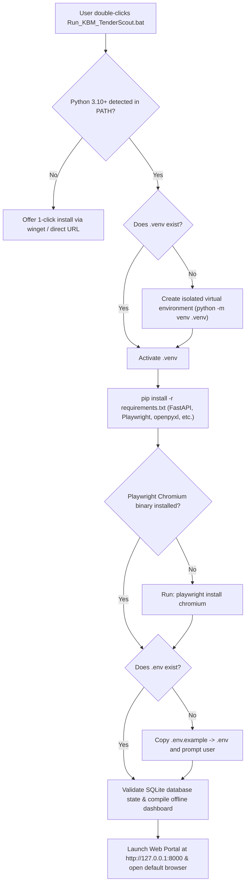

# KBM Tender Scout — Packaging & Deployment Guide

This document describes how KBM Tender Scout is packaged, how prerequisites are automatically verified and installed, and how any user can run the system on their machine with zero friction.

---

## 1. Executive Summary: Distribution Methods

| Method | Target User | Prerequisites Needed | How to Run |
| :--- | :--- | :--- | :--- |
| **A. One-Click Launcher (`Run_KBM_TenderScout.bat`)** | Anyone on Windows (Presales, Sales, Developers) | Python 3.10+ (Auto-detected; script prompts to install via `winget` if missing) | **Double-click `Run_KBM_TenderScout.bat`**. Automatically creates `.venv`, installs all packages, installs Playwright Chromium, and opens the web portal. |
| **B. Zero-Install Offline Dashboard (`open_offline_dashboard.bat`)** | Management & Presales reviewing results | **None** (No Python, no libraries, no internet required) | **Double-click `open_offline_dashboard.bat`** or double-click `output\reports\KBM_Tender_Dashboard.html`. Opens in Chrome/Edge immediately. |
| **C. Portable Distribution ZIP (`scripts/package_dist.py`)** | IT Admin / Colleague sharing via Teams, OneDrive, or Email | Python 3.10+ on recipient machine | Run `python scripts/package_dist.py`. Produces a clean `dist/KBM_TenderScout_v1.0.zip` ready to send. |
| **D. Docker Container (`docker-compose.yml`)** | Servers, Cloud VMs, macOS, Linux | Docker Desktop / Docker Engine | Run `docker compose up -d`. Access portal at `http://localhost:8000`. |

---

## 2. Automated Prerequisite Resolution Engine

When a user runs `Run_KBM_TenderScout.bat` or `python scripts/setup_environment.py`, the following 5 stages execute automatically:



### Stage 1: Python Runtime Detection
* Checks `python --version` and `py --version`.
* If neither exists, prints clear instructions and offers the standard Windows Package Manager command:
  ```powershell
  winget install Python.Python.3.11
  ```

### Stage 2: Isolated Virtual Environment (`.venv`)
* Creates an isolated virtual environment (`.venv`) so it **never alters the user's global Python environment or causes package conflicts**.
* All subsequent execution uses `.venv\Scripts\python.exe`.

### Stage 3: Python Package Dependencies
* Installs and verifies dependencies defined in `requirements.txt`:
  * **Web Portal & REST API:** `fastapi`, `uvicorn`, `python-multipart`
  * **Browser Automation:** `playwright`
  * **Document Processing:** `pdfplumber`, `pymupdf`, `pytesseract`, `Pillow`
  * **Text & Data Normalization:** `rapidfuzz`, `pydantic`, `pydantic-settings`, `pyyaml`
  * **Excel Generation:** `openpyxl`
  * **Presentation & Profile Parsing:** `python-pptx`

### Stage 4: Playwright Headless Chromium Binary
* Browser automation requires Playwright's Chromium driver.
* The script automatically downloads and registers the required binary into `%LOCALAPPDATA%\ms-playwright\chromium-*` so automated scraping never crashes.

### Stage 5: Secrets & Configuration Integrity
* Verifies `.env`.
* If missing on a new machine, automatically copies `.env.example` to `.env` without overwriting existing settings.
* Validates that real credentials are never leaked in logs or commits.

---

## 3. Creating a Distributable ZIP Package

To create a clean ZIP package to share with a colleague:

```powershell
python scripts/package_dist.py
```

### What this produces:
* Creates `dist/KBM_TenderScout_v1.0.zip`.
* **Security guarantee:** Strictly excludes `.env`, ensuring credentials are never bundled.
* **Size optimization:** Excludes `.git`, `.venv`, cache files (`__pycache__`), and temporary test traces.
* **Included ready-to-run files:**
  * All source code (`src/`), configuration (`config/`), and client mapping (`data/`).
  * `Run_KBM_TenderScout.bat` (1-click installer and launcher).
  * `open_offline_dashboard.bat` (1-click zero-install HTML viewer).
  * `run_collection.bat` (1-click scraper execution).
  * `output/reports/KBM_Tender_Dashboard.html` (pre-generated offline dashboard).
  * `output/reports/KBM_Tenders_Latest.xlsx` (pre-generated Excel workbook).
  * `README_PACKAGE.txt` (bilingual quick-start guide).

---

## 4. How Any Recipient Uses the Package

1. **Unzip** `KBM_TenderScout_v1.0.zip` to any folder (e.g. `C:\Users\Username\KBM_TenderScout`).
2. **Double-click `Run_KBM_TenderScout.bat`**.
3. That's it! The system will install all prerequisites automatically and launch the interactive portal in their browser.
